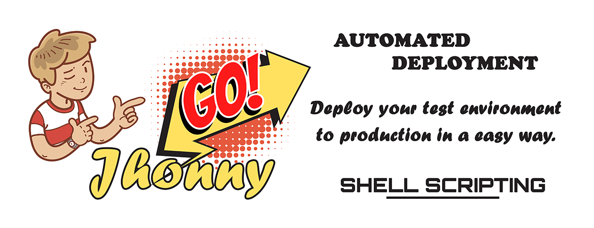

# automatic-deployment
Automatic deployment script through Vagrant

<p align="center">
  
</p>

&nbsp;
## Requirements
* Must have installed Vagrant in your PC.

	You can download vagrant by clicking in the follow address [https://www.vagrantup.com/downloads](https://www.vagrantup.com/downloads)

    In vagrant make sure you have the vagrant-disksize plugin installed, if not, install it with the follow command in your local PC.

    ```sh
    #> vagrant plugin install vagrant-disksize
    ```

* Must have installed Virtualbox in your PC.

    You can download virtualbox by clicking in the follow address https://www.virtualbox.org/wiki/Downloads
    
* **Optionally** you can to install composer if you want to use composer for to get the project.

    You can download and install composer following the instruction in the official web page https://getcomposer.org/download/

&nbsp;
## Description

This script developed with shell allows you to create a machine on a local PC by using vagrant at the same time that it deploy the local environment to remote production environment, in the same way, the script is capable of doing both "deployments and rollbacks" to the same time that makes commits to GitHub account.

&nbsp;
## Features

With this script you can:

* Create a locale environment by using vangrant.
* Deploy your local project to remote server with simple command **[deploy]** in your local server
* Rollback to previous versions of lasts deployments with a simple command **[undeploy]** in remote server
* You can decide how many deployments you want to keep on the remote server.
* You can decide which version you want to rollback from a list of deployments on the remote server by using a simple **[undeploy]** command on the remote server.

&nbsp;
## Tools, software and packages used
* Denian 9
* Vagrant 2.2.14
* Virtualbox 6.1
* Shell Script
* PHP
* Composer
* Apache
* MariaDB

&nbsp;
# How to use it
## Step-by-step installation.
1. Create an empty private repository on GitHub where project deployments will be stored and controlled.
    
    - This step will only be done the first time, since it is not necessary afterwards.
    - It is very important that you know that every time you create a new project, the repository must also be new.
    
---
    
2. Get the project.

    ##### USE THE OPTION YOU WANT TO GET THE PROJECT
    
    ---
    
    ###### OPTION 1 - GET FROM COMPOSER
    
    > Go to where you want to create the project.
    
    ```sh
    #> cd C:\Users\User\Documents
    ```
    
    > Create project using composer.
    
    ```sh
    #> composer create-project jhoncytech/automatic-deployment my-web
    ```
    
    > Go to new created directory.
    
    ```sh
    #> cd my-web
    ```
    ---
    
    ###### OPTION 2 - GET FROM GITHUB REPOSITORY
    
    > Go to where you want to create the project.
    
    ```sh
    #> cd C:\Users\User\Documents
    ```
    
    > Create a directory on your pc where the entire project will be managed.
    
    ```sh
    #> mkdir my-web
    ```
    
    > Go to new created directory.
    
    ```sh
    #> cd my-web
    ```
    
    > Clone from GitHub the Automatic Vagrant Deployment project by JhonnyGO.
    
    ```sh
    #> git clone git@github.com:jhonnygo/automatic-deployment.git .
    ```
---
    
3.  Edit the project **[Vagrantfile]** file.

    This file is located in the folder `C:\Users\User\Documents\my-web\Vagrantfile`
    
    It's very important that you edit the following mandatory parameters:
    
    * `config.vm.hostname = "my-web"` => Name of the host you want for your local server
    * `config.vm.network = "192.168.10.10` => Private IP you want for your local server
    * `vb.name = "local-my-web"`  => Machine name for Virtualbox
    
    There are more optional values, feel free to modify them according to your needs.
    
---
    
4.  Edit the **[00-shell-script-config.sh]** file

    This file is located in the folder `C:\Users\User\Documents\my-web\config\scripts\00-shell-script-config.sh`
    
    It's very important that you edit the following mandatory parameters:
    
    * `REMOTE_IP=""` It must be a public IP, since it is the IP of the remote server.
    * `LOCAL_IP="192.168.10.10"` It must be a private IP which is the IP of the local server used in Vagrantfile file.
    * `GIT_USER_NAME="Jeff Smith"` GitHub user who will perform the commits.
    * `GIT_USER_EMAIL="jeff.smith@gmail.com"` Email of the GitHub user who will perform the commits.
    * `REPO_GITHUB_HTML=""` URL in SSH format of the GitHub repository where the deployments will be made.
    
    NOTE: Remember that if you not indicated some password that password will be generated automatically.
    
---
    
5.  Create the SSH key pair to work with the project repository.

    > Go to following folder of the SSH project Keys: **[ssh-keys]**
    
    ```
    #> cd C:\Users\User\Documents\wy-web\config\ssh-keys
    #> ssh-keygen -t rsa -b 4096 -C "my-web-local"
    ```
    * Use as name: `ssh-key-local-test`
    * Keep password empty:
    
    The above command will create your SSH key pair.
    
    IMPORTANT: If you already have your own key pair, you can copy and paste them into this directory.
    
---
    
6.  Add the public key of your local server **[ssh-key-local-test.pub]** on the remote server so that the local server can communicate with the remote one.

    > In local server
    
    ```
    #> cd C:\Users\User\Documents\wy-web\config\ssh-keys
    #> cat ssh-key-local-test.pub
    ```

    > In remote server
    
    ```
    #> nano ~/.ssh/authorized_keys
    ```

    copy your local server's public key **[ssh-key-local-test.pub]** at the end of the file.
    
7.  Add the public key of your local server **[ssh-key-local-test.pub]** to the GitHub account that I created earlier.

---

8.  Now, Its time to starts the project.

    > In remote server
    
    ```
    #> cd C:\Users\User\Documents\wy-web
    #> vagrant up
    ```
    
---

# Available project's commands

## Local Server
*   Stop the project: `#> vagrant halt`
*   Start the project: `#> vagrant up`
*   Destroy the project: `#> vagrant destroy`
*   Deploy the project: `#> deploy`

## Remote Server
*   Undeploy the project: `#> undeploy`

# 

<p align="center">
  
</p>

### Contactos
    - Mail: jhonny@jhoncytech.com
    - Web: https://jhoncytech.com
    ---
    - Mail: contacto@jhonnygo.com
    - Web: https://jhonnygo.com
